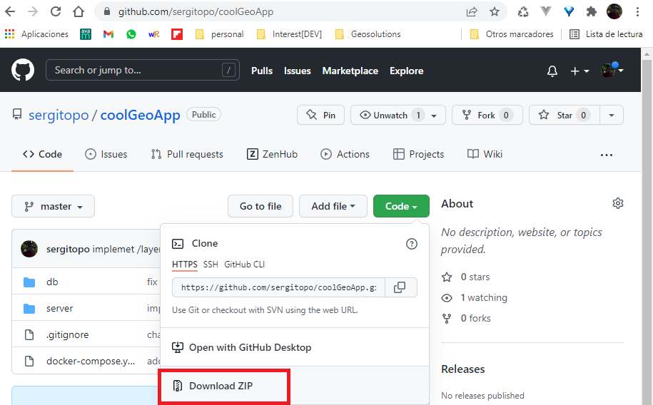

# coolGeoApp API

**CoolGeoApp** is a demo http REST API that exposes some services to feed several widgets and graphics of a web client.
It uses python and [Flask](https://flask.palletsprojects.com/) framework to implement and publish these web services.

The demo data (postal codes geometries and attributes and the paystats) are stored in a [PostgreSQL](https://www.postgresql.org/) database with the spatial extension [PostGIS](https://postgis.net/).


## Installation

You only need Docker installed in your computed to run the CoolGeoApp API. If not, go to [link](https://docs.docker.com/engine/install/) and download the corresponding for you SO and distro.

### 1. Download source code

If you have git installed:

```bash
    git clone https://github.com/sergitopo/coolGeoApp.git
    cd coolGeoApp
```
If not, download the code as a zip file from https://github.com/sergitopo, decompress it and open a terminal from the root folder.

 


### 2. Build and run the application

Once docker is installed and a terminal from the root folder opened, execute:

```bash
    docker-compose up
```
Docker takes care of downloading the base images, building the two new images required (app_db, app_server), it creates a container from each and finally start them.

## Usage

Once the logs of the docker program and the containers show that the application has started. Go to any http client like a browser, postman o curl and execute the following requests:

 http://localhost:9999/layers/postalcodes/union

 http://localhost:9999/turnover/postalcode/28001

 http://localhost:9999/layers/postalcodes?geometry=POLYGON((-3.69293574588795%2040.4192827141259,-3.69293574588795%2040.4303566393474,-3.67557441292882%2040.4303566393474,-3.67557441292882%2040.4192827141259,-3.69293574588795%2040.4192827141259))

The first service returns the union of all geometries in postal codes and adds all the turnover.

The second service returns turnover info for a given postal code. You can try changing the code path parameter and checking that responses are cached until the max size reached, so requesting with the same code it is faster after the first.

The third service returns postal code geometries and its turnover. It accepts also startdate and enddate query parameters, so try for example changing the geometry or adding date filters and check that results vary each time.

## Improvements
* Publish geometries in MVT (Mapbox vector tiles).
* Adding authentication to the backend.

## License
[MIT](https://choosealicense.com/licenses/mit/)
